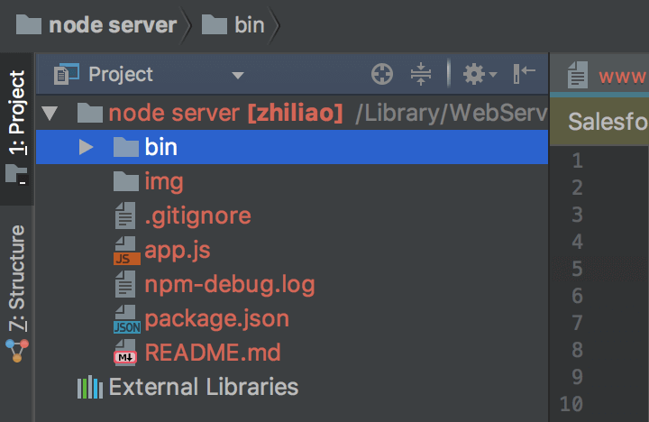
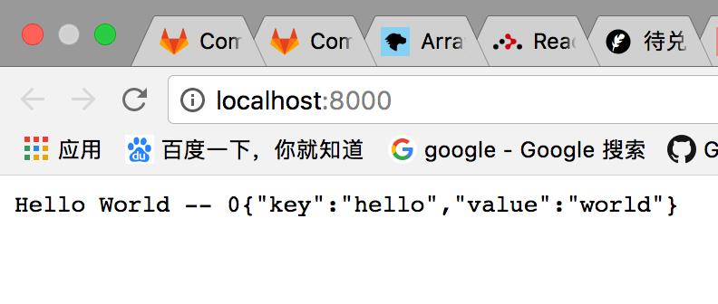
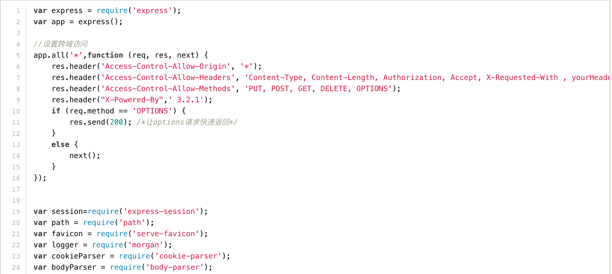
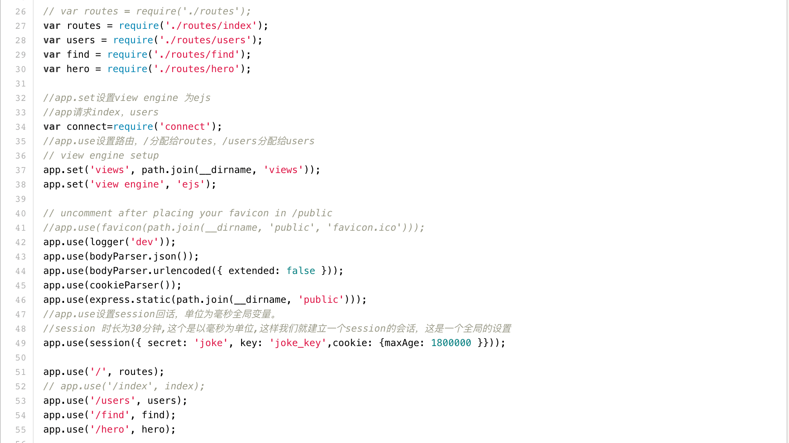
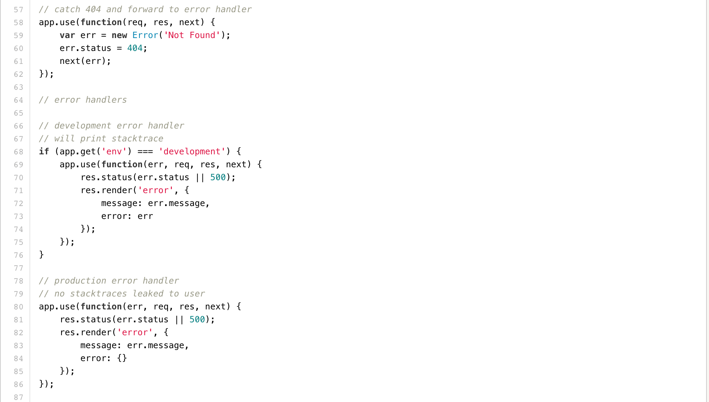
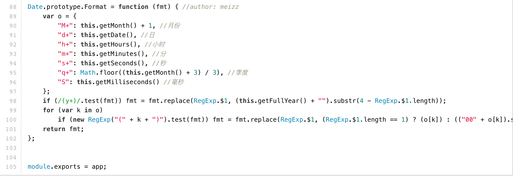

### Node: 最简单的node server
#### 项目结构
  <br />

主要文件  <br />
* bin/www
* package.json

#### 确定并安装node
```
$ node -v
```

### bin/www
```
var http = require('http');
var port = 8000;

/**
 * var app = require('../app');
 * var server = http.createServer(app);
 */

var data = { key: 'hello', value: 'world'};

var server = http.createServer(function(request,response){
    response.writeHead(200,{
        'content-type': 'application/json'
    });
    response.write('Hello World -- 0');
    response.end(JSON.stringify(data));
});

server.listen(port);
console.log('Server running on port 8000');
```

### package.json
可以参考配置scripts
```
{
  "name": "node-server",
  "version": "1.0.0",
  "description": "A project that introduces simple node services",
  "main": "N",
  "scripts": {
    "start": "node ./bin/www",
    "test": "echo \"Error: no test specified\" && exit 1"
  },
  "author": "lianpf",
  "license": "ISC"
}
```

如果不想增加更多配置, 可以命令行 node ./bin/www  不用配置package.json

#### 启动
```
$ npm run start //启动server
```
浏览器直接访问 localhost:8000 可以直接看到response返回数据  <br />
  <br />

#### 拓展
注意看项目结构的同学肯定注意到了没有提到app.js文件, 以及bin/www 文件里注释的app相关的代码,
这里要讲的是app.js是一个配置文件, 可以配置router等相关信息。然后启动node server, 提供接口服务。
可以参考我之前项目app.js的配置, 有兴趣的同学自己拓展.  <br />
  <br />
  <br />
  <br />
  <br />